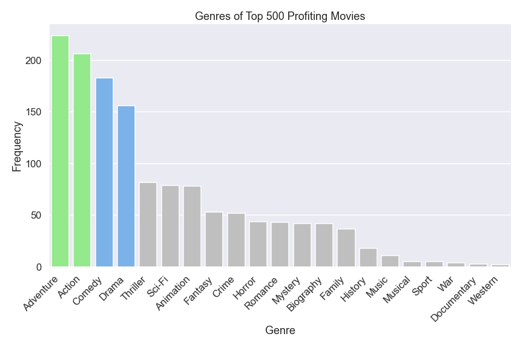
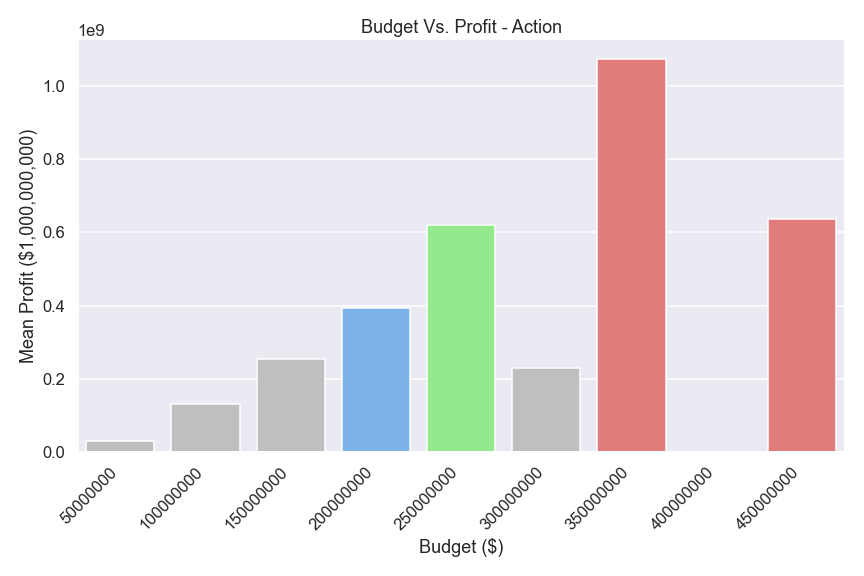
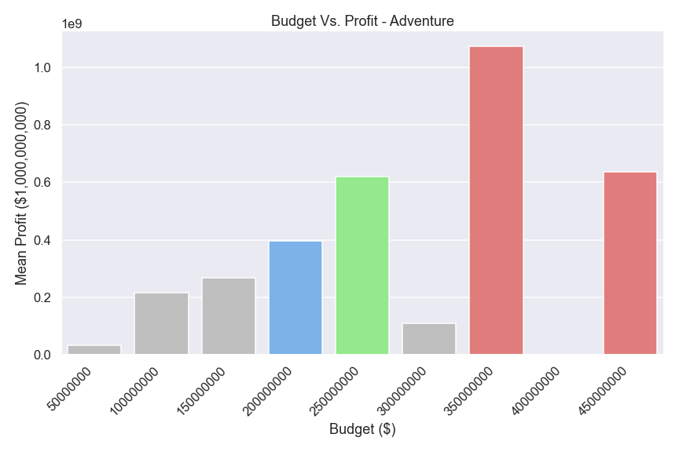
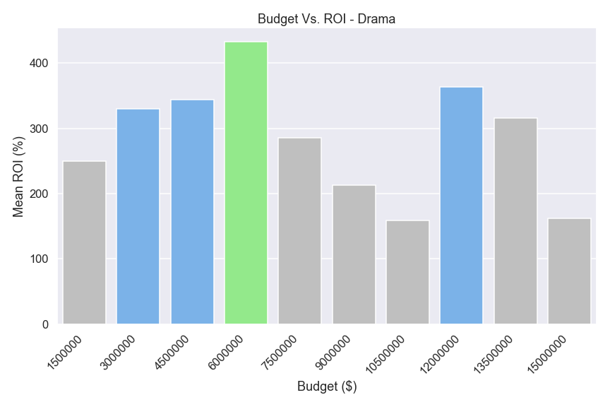
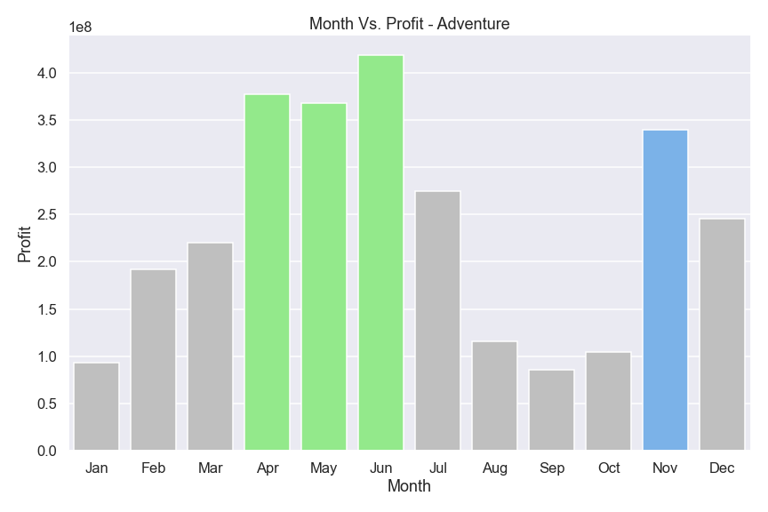
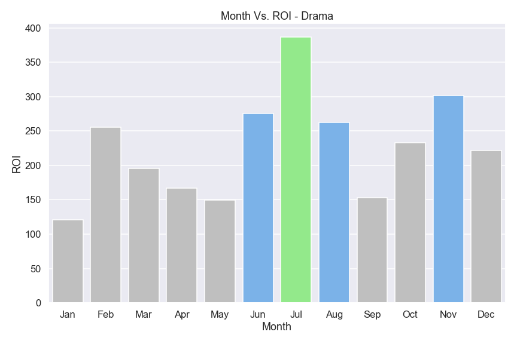
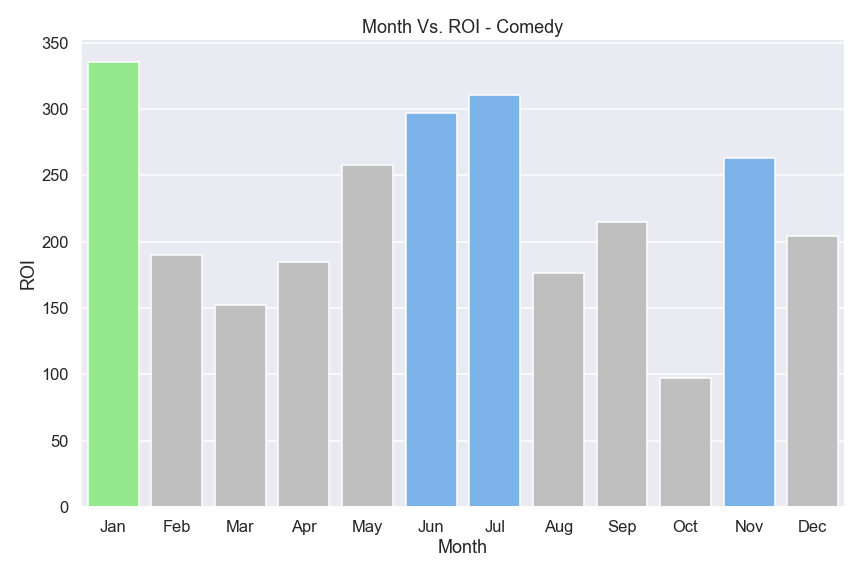

# Microsoft Movie Analysis

Author: Hogan Byun

## Project Overview

This project analyizes movie databases in order to assist a potential, new movie studio in making decisions. Data analysis shows that, depending on specific goals, Microsoft should aim to create either an action, adventure, drama, or comedy movie. Further details, such as budget and release time, provide more flexibility. Microsoft can use these options to choose the best choices that fit their needs and constraints.

### Business Problem

Microsoft sees all the big companies creating original video content and they want to get in on the fun. They have decided to create a new movie studio, but they don’t know anything about creating movies. Exploring what types of films are currently doing the best at the box office will be able to translate into actionable insights that the head of Microsoft's new movie studio can use to help decide what type of films to create.

### The Data

Data is taken from the following movie databases: IMDB, TheMovieDB.org, TN. Movies are identified by unique keys. Data about each movie can include information such as: release date, budget, gross, ratings, and other data that may help investigate this problem. 

### Methods

This project uses descriptive analysis and visualization through Python and associated libraries such as Pandas and Seaborn. Time-series, bar, and regression plots are all utilized to help decide what movies to create. In particular, analysis was done on profit and ROI data, genre-based data, budgeting data, and month-by-month data. 

### Results

**CHOOSING A GOAL**
Firstly, as a data scientist, I aim to provide recommendations, but the decisions and choices are ultimately up to the client. Here, I provided two tracks that Microsoft can take, depending on what their goal is for a specific movie: maximizing profit or maximizing ROI. 

In order to first verify that ROI and profit are two separate goals, and not dependent on one another, we must first see the relationship between the two. In the first graph (black box), we see that the slope of the regression plot is relatively flat. What this tells us is that an increase in one does not necessarily mean you will see an increase in the other. The next four graphs show the relationship of ROI and profit with media presence. The top two focus on ROI compared with number of votes on a review site and average rating. The bottom two focus on profit, which we can see, from the steepness of the lines, has a more positive relationship with both votes and ratings. Thus, we can say that a pro for focusing on profit is that you are more likely to see an increase in media presence. 

*(It is worth noting that moving forward, bar graphs are color-coded to the same key. Green indicates ideal choice(s). Blue indicates good, secondary choice(s) and red indicates areas of caution.*

**CHOOSING A GENRE**
Once the goal is figured out, it is now time to figure out which genre the movie will belong to.

This first graph shows the genres among the top 500 profiting movies. Each movie is given certain genre tags, with a possiblity of having more than one. For example, *Avatar* may have Action, Adventure, and Sci-Fi tags. These tags are scraped from each movie and summed, resulting in the plot above. Here we see that Action and Adventure are the leading genres, with Comedy and Drama trailing behind. Thus if choosing to maximize profit, Action and Adventure are recommended, yet if unable to do so, Comedy and Drama are good, secondary options. 

This next graph is similar to the one above except it shows the genres for the top 500 ROI movies. In this case, Comedy and Drama are ideal while Action and Adventure are good alternatives. Notice that the top 4 for both graphs stayed the same and it was only the order of the genres that changed. This tells us that regardless of whether you are focusing on ROI or profit, as long as you stick to Action, Adventure, Comedy, or Drama, you have a pretty safe floor for both goals. 

**CHOOSING A BUDGET**
Depending on which genre is selected, an appropriate budget must be chosen as well. 

This plot separates Action movies into budget groups and measures the average profit for each tier. In this case, while we do see the max at $300-350 million, this should be approached with caution as this bar (and the other red bar) only contain data from one movie. Thus, these bars are not really averages and may not be trustworthy. Instead, to be safer, the optimal choice here would be $200-250 million. A fine alternative is $150-200 million.

Here we see that the budget v. profit plot for adventure movies is nearly identical to that of action movies. This makes sense because there was a considerable amount of movies with both action and adventure tags. As a result, the recommendations are the same. Stick with $200-250 million. If unable, use $150-200 million and approach anything above $300 million with caution. 

For drama movies, we look at the budget's relationship with ROI instead of profit. Here, we see that the ideal budget is within the first budget tier (with good alternatives at $50-75 million and $100-125 million). Thus, to have a more accurate picture of how much to spend, a zoomed in picture is provided below. 

We can see that the optimal budget is $4.5-6 million with other options at $1.5-4.5 million and $10.5-12 million.

Lastly, for comedy movies, we see an optimal budget of $75-100 million. $25-50 million and $100-125 million are also good options. $150-175 million may seem attractive with a high mean ROI, but because there are only 3 movies accounted for in that budget group, we advise to approach it with caution. 

One thing to note with budgets is that focusing on ROI allows you to use a smaller budget, which may be advantageous. 

**CHOOSING A RELEASE MONTH**
Choosing the right time to release a movie can actually be crucial when determining profit or ROI. Here are the findings, separated by genre.

Here, the plot shows the mean profit depending on when an action movie is released. We see that April through June are the ideal choice. However, if the studio is unable to release a movie in that period, November is also a suitable option. 

Unsuprisingly, just like with budgets, adventure movies match in recommendations with action movies. Stick with April through June or opt for November.

With drama movies, ROI is switched in for profit. The obvious choice here is July. However, if unable to do so, other options include the remaining summer months and November. 

Comedy movies should be released in January and if not, June, July, and November are good alternatives.

### Final Recommendations

After combining each recommendation, we come to the conclusion that:

1. Profit-focused movies should be **Action/Adventure** with a budget of **$200-250 million** releasing during **April through June**.

2. ROI-focused movies should be with a **Drama** movie with a **$4.5-6 million** budget releasing in **July** or a **Comedy movie** with a **$75-100 million** budget releasing in **January**.

3. Lastly, a personal recommendation is to use a combination of the two. **Release and Action/Adventure movies first, then release Drama/Comedy movies**. The reasoning behind this is that any new movie studio, when entering the industry, needs to establish itself first and foremost. Because Microsoft is a large company, we are assuming that a large budget is available for this movie studio. Releasing an Action/Adventure movie will increase media presence as well as increase overall profit (ie. more people will watch it), thus cementing the studio's place in the industry. Once that is done, the studio will be free to focus on smallr-budget projects that are more likely to maximize return of investment.

### Future Work

On top of the analysis done so far, there are a few areas that I would like to examine more to provide a clearer picture of how to approach this movie industry:

1. **More ways to measure media presence**: The only metrics provided for media presence were votes and rating. Looking at other metrics (awards, article mentions, etc.) would be helpful in providing a more accurate answer to how profit and ROI affect media presence.

2. **Standardizing genre analysis**: The reason that the four genres showed up the most in the top 500 may just be because a higher proportion of those genres were made over others. Thus, standardizing each genre could help confirm the intial recommendations.

3. **What makes a studio successful?**: This one is more of a broad question that encompasses how success if measured and how studios attain that success. Could personnel (directors, actors, etc.) and partners (Disney, DreamWorks, etc.) have a large impact on this as well?

## For More Information

See the full analysis in the [Jupyter Notebook](./Movie_analysis_code.ipynb) or review this [presentation](./Microsoft_Movie_Analysis_Presentation.pdf).

For additional info, contact Hogan Byun at [hoganbyun@gmail.com](mailto:hoganbyun@gmail.com)
